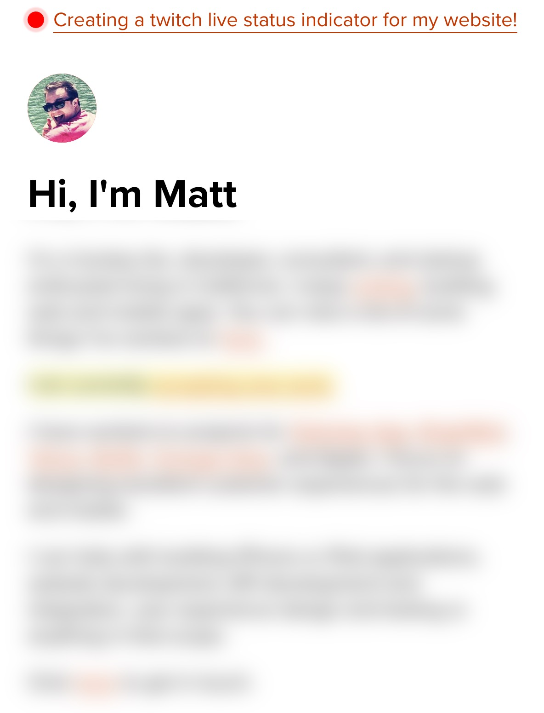

Get a live status indicator like this one:

# Getting Started

To use this, you'll need to create a twitch developer account and a client id. 

## Installing:

On your website, include the code from index.html